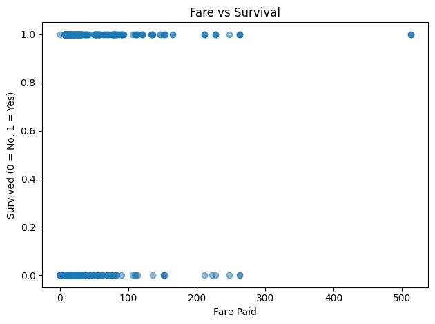
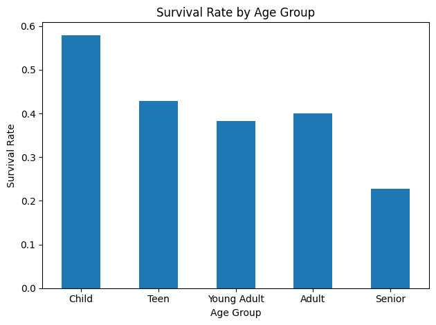

# Titanic Survival Analysis (Python EDA)

This project performs exploratory data analysis (EDA) on the Titanic dataset to uncover patterns and factors that influenced passenger survival.

## Objective

Analyze passenger data to identify key factors such as class, gender, age, and fare that impacted survival rates.

## Tools Used

- Python
- Pandas
- Seaborn
- Matplotlib
- Jupyter Notebook

## Visualizations

### Fare vs Survival

### Survival Rate by Group

## Key Insights

- Passengers who paid higher fares were more likely to survive  
- Female passengers had significantly higher survival rates  
- Higher class passengers were more likely to survive  
- Survival patterns highlight socioeconomic differences onboard  

## Project Files

- `titanic_analysis.ipynb` – main notebook  
- `titanic-chart-1.png` – fare vs survival visualization  
- `titanic-chart-3.png` – survival rate by group  
